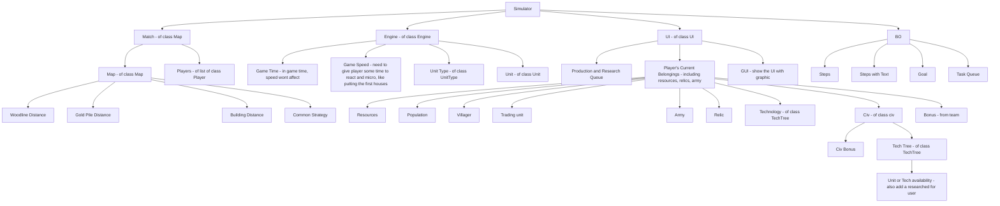

## Goal

- Simulator of AOE2:DE build for multiple players.
- Implement some algorithm to see the best strategy for each civ / civ group strategy.
  - Like what's the best civ combination for 2/3/4 players.
  - What's the best strategy for civ-s vs civ-s.
  - What's the best play style for certain civ-s on a certain map.
  - Maybe use AI, but need metrics (hard to evaluate).
  - Maybe more simulation for battle field simulation.

## Docs

- Design Docs
- How to use
- How to contribute
- CLI/API
- Tech Stack

### Design Docs

Classes:

- #TODO: User mermaid for diagram

- Simulator
  - Match (of class Map)
  - Engine (of class Engine)
  - UI (of class UI)
  - BuildOrder
- BuildOrder
  - id
  - name
  - task queue
- UI
  - Tic
  - Production and research queue
  - Players' current belongings (including resources, relics, army)
  - GUI (show the UI with graphic)
- Match
  - map (of class Map)
  - players (of list of class Player)
- Engine
  - Game time (in game time, speed wont affect)
  - Game speed (need to give player some time to react and micro, like putting the first houses)
  - UnitType (of class UnitType)
  - Unit (of class Unit)
  - Maybe we just implement OpenAge.
- Map
  - Wood line distance
  - Gold pile distance
  - Building distance
  - Common strategy
- Player (belongings)
  - Resources
  - Population
  - Villager
  - Trading Unit
  - Army
  - Relic
  - Technology (of class TechTree)
  - Civ (of class civ)
  - Bonus (from team)
- Civ
  - Civ Bonus
  - Tech Tree (of class TechTree)
- Tech Tree
  - Unit/tech availability (also add a researched for user)
- Build Order
  - Steps
  - Steps with text
  - Goal

### stack

- We are using Python / Flask now.

### CLI and API

- Current mature projects from [Siege Engineers](https://siegeengineers.org/projects)
- aoe2map.net for map scripts
- recs for training AI
- data mods [SiegeEngineers/auto-mods](https://github.com/SiegeEngineers/auto-mods)
- tech data [SiegeEngineers/halfon](https://github.com/SiegeEngineers/halfon/)
- more simulation with [OpenAge](https://blog.openage.dev/), [repo](https://github.com/SFTtech/openage) or [CaptureAge](https://captureage.com/) for metrics for AI.

## Dev

### Tasks (in order)

- Docs
- UI
  - Text based UI, with CLI
- Basic Game Engine (Villagers and some resources, a few maps)
- Database (scrawl / API)
- Build Order for Unit test
- Better Game Engine
  - Reading rms file
  - Resources distance with average value
  - Villager walking simulation
  - NO farming simulation
- Basic GUI
  - Show important info like CaptureAge
- Basic Build Orders (like 1v1 mongol scouts 17p)
- Basic Build Order Verifier
  - Check if the build order is valid
  - Generate a report
- Full Eco Game Engine
  - Market efficiency
  - Collectable resources with random distance
  - Eco upgrades
  - Farming simulation
  - Units training cost
- Group Build Order
  - Check if the build order is feasible for the civ group
- Better GUI
  - User can interact with the GUI
    - Pause / Resume
    - Re-task some unit in Build Order Verifier
  - User can pick civ with GUI
- Build Order Verifier v2
  - Verify a group build order (like teuton-khmer farm sling)
  - Check if the build order is feasible for the civ group
- Build Order Generator
  - Algorithm to find a fastest Build Order to achieve some goal, single player (like 20min FI)
- Combat system (Part of Game Engine, doesn't need to be exact)
- AOE-AI simulator.
  - Read AI scripts.
- Build Order Generator v2
  - Algorithm to find a fastest Build Order to achieve some goal, more players, considering ban-pick.
- Game balance
  - Run random civ vs random civ to see the game balance.
